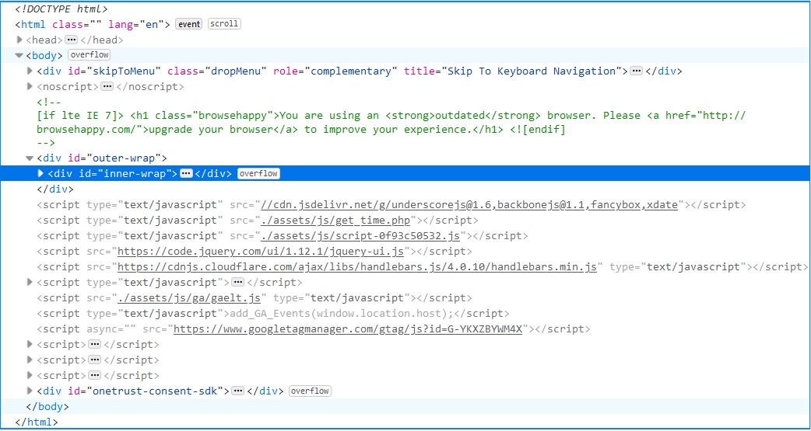

Html, javascript was present on the UIUC libary website. CSS was not present. There really isn't anything I don't recongonize because it is all script coding and html mainly. 
Here is the link to website: <h1><a href="https://www.library.illinois.edu///">THE WEBSITE</h1>

